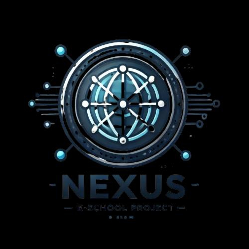

# Sprint-9th-grade-Eschool
<h2 align="center">TEAM NEXUS<h1></h2>

<p align="center">
 
</p>

#  About the idea
Nexus E-School is an electronic school platform where students can log in, take tests, and view their grades. The goal is to make online learning seamless and efficient through an intuitive interface.

<br>


##  Our Team 🧒<br>
- **Teodor Despotov** - Scrum Trainer  (<a href = "https://github.com/TVDespotov23">GitHub</a>)<br>
- **Kaloyan Boychev** - Backend Developer (<a href = "https://github.com/KIBoychev23">GitHub</a>)<br>
- **Valeri Tenev** - Frontend Developer (<a href = "https://github.com/VATenev23">GitHub</a>)<br>
- **Lyubomir Iliev** - Designer (<a href = "https://github.com/LANliev23">GitHub</a>)<br>

<br>

## Tech Stack
Used code editor & collaborative service:
<p align="left">
 <a href="https://visualstudio.microsoft.com/vs/"></a>
 <a href="https://github.com/"></a>
<a href="https://git-scm.com/"></a>
</p>

Design
<p align="left">
    <a href="https://www.figma.com/"></a>
</p>
E-school
<p align="left">
    <a href="https://cplusplus.com/"></a>
    <a href="https://www.raylib.com/"></a>
</p>
Used tools for our documentation, presentation & communication:

<p align="left">
    <a href="https://www.microsoft.com/en-ww/microsoft-365/word"></a>
    <a href="https://www.microsoft.com/en-ww/microsoft-365/powerpoint"></a>
    <a href="https://www.microsoft.com/en/microsoft-teams/group-chat-software"></a>
</p>
<hr>
## Installation

To clone our repo locally, use the following command in your preferred terminal:

```bash
git clone https://github.com/codingburgas/sprint-eschool-nexus.git
```
<hr>
